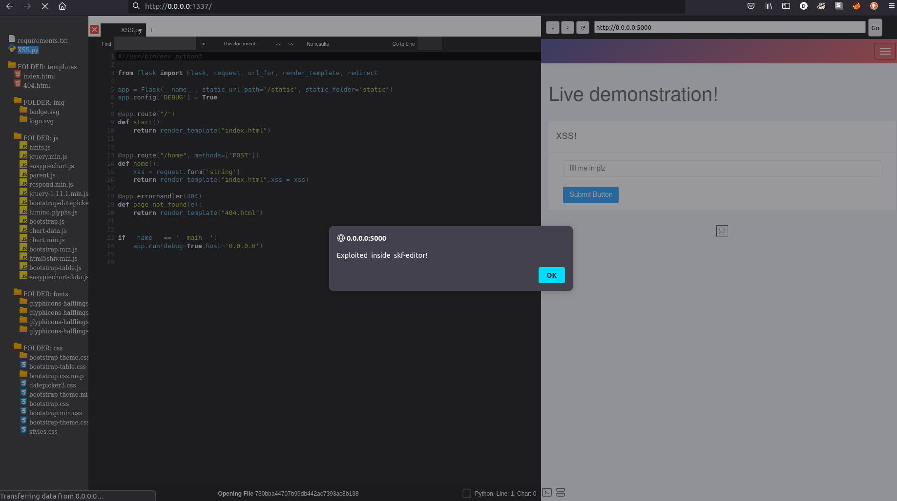
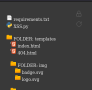

# skf-editor [GSOC'21]

This project is released as contribution to the [OWASP Security Knowledge framework](https://www.securityknowledgeframework.org/) and developed during [Google Summer of Code 2021](https://summerofcode.withgoogle.com/projects/#5895727206629376) by the student [Diego Porras](https://www.linkedin.com/in/daporras/). All the code contributed during GSoC21 duration is hosted under this repository.

### What is SKF?
Security Knowledge Framework (SKF) is a tool that is used as a guide for building and verifying secure software. It can also be used to train developers about application security. The OWASP Security Knowledge Framework is an expert system web-application that uses the OWASP Application Security Verification Standard and other resources. It can be used to support developers in pre-development (security by design) as well as after code is released (OWASP ASVS Level 1-3).

## What is skf-editor?
SKF-editor is a browser-based text editor. It allows the user to visualize the source code of the current lab and interactively play with a sandbox environment that allows for code fixing and testing. The users are provided with the ability to not only exploit the vulnerability vias SKF labs, embedded in a browser-like component alongside the editor, but visualize the underlying source of the security issue and attempt to fix it. 

This fixing feature verifies the user solution for inconsistencies in syntax, and after proving that the service won’t be crashed by the changes, run the newly modified version overriding the original one. In this way we enable the user to dynamically test for the secure code fragment that fixes the root cause of the issue exemplified in the lab.

## Integration with SKF-Labs
To integrate SKF-editor browser feature with the current SKF-labs and additonal script is provided. The purpouse of this script is to allow the iframed lab to report its URL back to the parent in order to make the integration seamsly. This script is included in this repo under  ``` lab/static/js/parent.js ``` And you just need to include it in the labs HTML code as:
```html 
<script src="assets/js/parent.js"></script>
```
Further details about interation can be seen in this
[commit](https://github.com/dporr/skf-editor/commit/87c377a568837172d3f8a2621657098d19a721a9)

During initial loading of the editor we should point to the appropiate lab URL under the iframe value in index, see details [here](https://github.com/dporr/skf-editor/blob/edf09afc52613dbb9927e40e61ec7f6724de48a6/editor/templates/index.html#L337). I  suggest publishing the curent lab under the  `localhost:8080` to avoid further changes.  

```html
<iframe id="browser-iframe" src="http://localhost:8080" style="border:none;display:block;width: 100%; height: 100%;"></iframe>

```

## Credits to ICECoder and CodeMirror:
This project makes extensive use of [ICEcoder](https://github.com/icecoder/ICEcoder) a lightweight text editor written in PHP and Javacript under MIT licence available [here](https://github.com/icecoder/ICEcoder/blob/master/LICENSE.md). We also leveraged the awesome javascript-based code editor [CodeMirror](https://codemirror.net/) under MIT license availabel [here](https://github.com/codemirror/CodeMirror/blob/master/LICENSE)


## Main components

### Browser
On the right, we have a browser-like component that allows visualizing SKF labs alongside the editor. The lab's exploitation remains the same with the facility of having the lab in the same window as the rest of the components. This browser has an internal history to go back and forth between visited URLs.

<p align="center">
  
</p>

``` In the image we appreciate the``` [XSS](https://github.com/blabla1337/skf-labs/tree/master/XSS) ```lab being exploited inside the editor```



### File explorer
The file explorer consists of a set of API endpoints and the frontend component that displays the file tree. To see the endpoints documentation visit the ```/api``` route in the current editor instance url.

<p align="center">
  
</p>

### Code editor

<p align="center">
  
</p>

### Terminal
<p align="center">
  
</p>

# TODO
This humble contribution to open source is not near to perfect and still needs enhancements that I as contributor expect to accomplish outside GSoC21. We encourage the open source community to flag any missing feature or enhancement so we can build the best version of this contribution. The known open issues are:

* Dockerize the project alongside the lab
* Make panels resizable
* Make the browser detachable to open in its own window
* Implement logs module to centralize all application and container logs to improve debugging experience
* Implement backup feature to have file diffing and versioning in the frontend
* Add feature for code linting/checking to validate the user solution
* Implement abuse test cases to enhance the code-fixing by presenting the user with the automated test suite for bypasses for the provided solution


